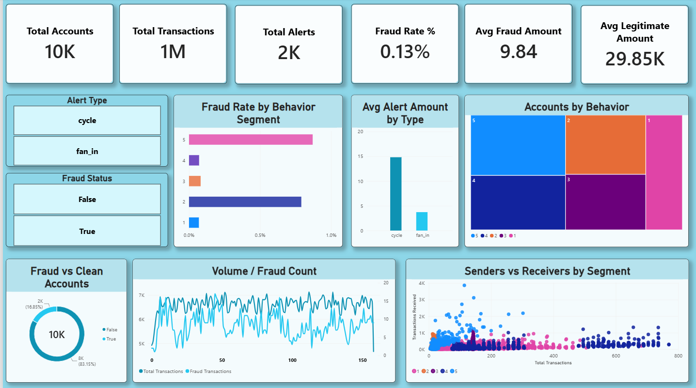

# FraudLens — AML Transaction Intelligence Dashboard

A Power BI dashboard for analyzing anti-money-laundering (AML) transaction data — surfacing fraud patterns across accounts, transactions, and alerts through a single, scroll-based report page.



## 📌 Overview

FraudLens connects three datasets — **accounts**, **transactions**, and **alerts** — into a proper star schema and layers 25+ DAX measures on top to answer a single question: *where is fraud concentrated, and which behavior segments and alert typologies drive it?*

Built as part of a Financial Data Analyst portfolio project.

## 🗂️ Data Model

| Table | Role | Key Fields |
|---|---|---|
| `accounts` | Dimension | `ACCOUNT_ID`, `CUSTOMER_ID`, `COUNTRY`, `ACCOUNT_TYPE`, `TX_BEHAVIOR_ID`, `IS_FRAUD` |
| `transactions` | Fact | `TX_ID`, `SENDER_ACCOUNT_ID`, `RECEIVER_ACCOUNT_ID`, `TX_AMOUNT`, `TIMESTAMP`, `IS_FRAUD` |
| `alerts` | Fact | `TX_ID`, `ALERT_TYPE`, `TX_AMOUNT`, `IS_FRAUD` |
| `_measures` | Measure home table | 25+ DAX measures (no data) |

**Relationships**
- `accounts[ACCOUNT_ID]` → `transactions[SENDER_ACCOUNT_ID]` — active
- `accounts[ACCOUNT_ID]` → `transactions[RECEIVER_ACCOUNT_ID]` — inactive (used via `USERELATIONSHIP` for receiver-side measures)
- `alerts[TX_ID]` ↔ `transactions[TX_ID]` — one-to-one, bidirectional

## 📊 Dashboard Sections

- **KPI Cards** — Total Accounts, Transactions, Alerts, Fraud Rate %, Avg Fraud/Legitimate Amount
- **Filter Bar** — Alert Type, Behavior Segment, Fraud Status (account & transaction level)
- **Distribution** — Fraud vs clean accounts, fraud vs legit transactions, alert type split
- **Composition** — Treemaps for alerts by type, accounts by behavior, amount by fraud status
- **Comparison** — Fraud rate by behavior segment, alerts by type, avg alert amount by type
- **Relationships** — Amount vs. timestamp scatter, senders vs. receivers by segment
- **Trends** — Transaction/fraud volume over time, cumulative fraud trend
- **Deep-Dive Tables** — Behavior × fraud rate, alert type × avg amount, top accounts drill-down
- **Root-Cause Analysis** — Decomposition tree: fraud count → behavior segment → alert type

## 🔑 Key Measures (DAX)

```dax
Fraud Rate % = DIVIDE([Fraud Transactions], [Total Transactions])
Fraud Amount Share % = DIVIDE([Fraud Transaction Amount], [Total Transaction Amount])
Transactions Received = CALCULATE([Total Transactions], USERELATIONSHIP(accounts[ACCOUNT_ID], transactions[RECEIVER_ACCOUNT_ID]))
Cumulative Fraud Transactions = 
    CALCULATE([Fraud Transactions], FILTER(ALL(transactions[TIMESTAMP]), transactions[TIMESTAMP] <= MAX(transactions[TIMESTAMP])))
```

Full measure list is in the `_measures` table inside the `.pbix` file.

## 🛠️ Tech Stack

- **Power BI Desktop** — data modeling, DAX, report design
- **Star schema** design with role-playing dimension handling for sender/receiver accounts

## 📈 Sample Insights

- Fraud rate sits at **0.13%** of all transactions, but average fraud transaction value (**9.84**) is far smaller than average legitimate value (**29.85K**) — fraud here shows up as high *frequency*, low *ticket size*.
- Behavior segments **2** and **5** account for the bulk of flagged activity in the fraud-rate-by-segment view.
- Alert types are limited to two typologies: **cycle** and **fan_in**.

## 🚀 How to Use

1. Clone this repo
2. Open `FraudLens.pbix` in Power BI Desktop
3. Refresh data source connections if prompted
4. Explore via the filter bar (Alert Type / Behavior Segment / Fraud Status)

## 📄 License

MIT — free to use and adapt for learning purposes.

---
*Built by Pothi Raja D — B.Com Fintech with AI, AMET University*
